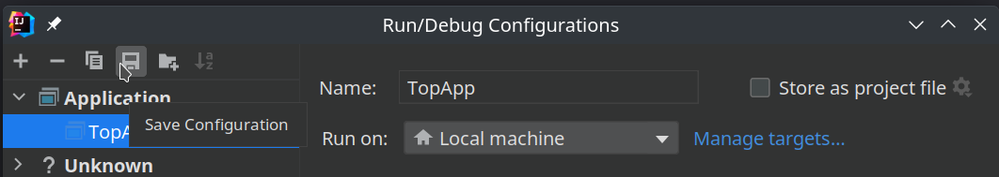

克隆之后：

1. 在`startup.sh`里：
   1. 通过更改`SBT_PROJ_NAME`更改SBT里的项目名。
   2. 通过更改`CMAKE_PROJ_NAME`更改CMake里的项目名。
   3. 通过更改`CMAKE_EXE_NAME`更改CMake里的可执行文件target名。
   4. 如果这是一个新项目而不是对Template的更改的话，你可以设置`NEW_GIT=y`重新建立Git仓库。

   **注意：SBT的项目名和CMake的项目名不要相同！**

2. **在项目根目录**执行`startup.sh`。

3. 如果你的项目需要用到`NVBOARD`的话，在CMakeLists.txt里将`set(CONFIG_USING_NVBOARD "n")`设置成`set(CONFIG_USING_NVBOARD "y")`。反之如果你不需要用NVBoard的话，同理。

   此外，请确认在NVBoard项目根目录执行了`make -f scripts/nvboard.mk nvboard-archive`。这个命令会编译NVBoard并且归纳成了在NVBoard项目根目录下build/nvboard.a链接库。

   也请确认，你执行`./startup.sh`的命令行有`NVBOARD_HOME`这个环境变量（`./startup.sh`会做这个检查）。

4. 打开IDEA，此时IDEA应该能识别出Scala项目（在右下角通知），等待SBT载入完成。

   之后点进`src/main/scala/TopApp`，可以看到一个运行符号，点击，然后选择“Modify Run Configuration”即可编辑运行信息。

   如果需要保存的话，需要点击右上角的"Select Run/Debug Configuration"，再点击"Edit Configuration"：

   

   然后在弹出窗口点击保存图标：

   

   即可完成保存。

5. 打开CLion，此时CLion应该能识别出是CMake项目，等待CMake载入完成。

注意：

* 为了使用`.scalafmt.conf`，请参考[这个文里面IDEA部分](https://github.com/BJTU-NSCSCC-2023/notebooks/blob/master/Chisel/env_startup.md)的说明，将IDEA的Scala格式设置成“使用`.scalafmt.conf`”。
* 如果上述流程走完，发现CLion或者IDEA没有成功识别项目，那就File->Invalidate Caches->全选Optional->Invalidate and Restart。这个应该是JB的bug。。。

编辑、调试项目的流程：

1. 打开IDEA，更改Chisel代码，通过Chisel的Test等完成初步验证。
2. 之后如果需要上Verilog验证的话：
   1. 打开CLion，**先build或者run一下，刷新Verilog代码**。
   2. 之后如果Chisel更改比较大的话，就需要重新编写C++代码（比如输入输出接口不一样之类的）。
   3. 虽然我还没实验出来，但是如果第1步出错或者出了奇怪的问题的话，可以尝试删除cmake生成的文件夹（一般是`cmake-build-debug`或者`cmake-build-release`），然后[重新载入cmake项目](https://www.jetbrains.com/help/clion/reloading-project.html)。

注意：建议运行时设置"Working Directory"为项目根目录（也就是在最终效果上为，在项目根目录执行了可执行文件）。

如果出现了莫名其妙的错误，请先检查：

1. 是否没有设置环境变量NVBOARD_HOME。

   NVBoard项目没有特别好地做这个检查。有谁有时间可以去提个PR（

目前可能的BUG，使用时如果发现类似问题请在相关issue下回复。

1. 在构建完CMake项目后，新添加的.scala文件无法被CMake识别，也就无法让CMake自动重新构建。

   相关issue：[我感觉目前实现的CMakeLists.txt依赖管理有BUG](https://github.com/BJTU-NSCSCC-2023/chisel-template/issues/2)。

目前待讨论/待办的事项请见Issue。
